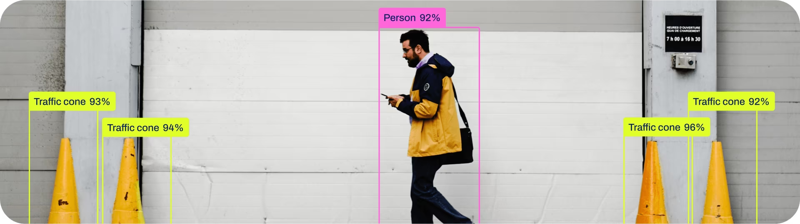
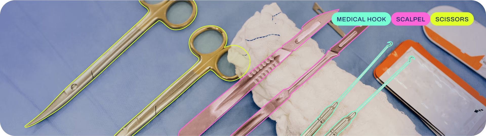
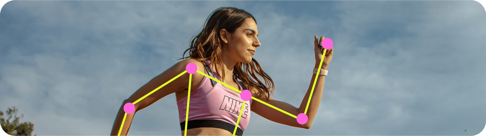

# YOLO 개요

## [1] 인공지능의 분류

### 1.1.규칙기반 (Rule Based)
사람이 직접 만든 **규칙 및 수학**으로 문제를 해결  

### 1.2. 머신러닝 (Machine Learning, ML)
**데이터에서 자동으로 규칙과 패턴을 학습**해 예측·판단 수행  

## [2] 머신러닝의 분류

### 2.1. 모델(머신)에 따른 분류

> **모델이란?**  
> - 모델은 $y=mx+n$ 같은 일종의 함수.  
> - x: 입력값 , y: 출력값  
> - AI 모델이 학습한다: 데이터를 통해 적당한 가중치(m, n)을 조금씩 수정해 가는 것.

1. **딥러닝 (DeepLearning, ML)**  
    - DNN 및 DNN 계열의 모델을 사용
    - CNN, RNN, Tranformer 등
1. 서포트 벡터 머신 (SVM)
1. 의사결정 나무 (Decision Tree)    
...

### 2.2. 학습(러닝)에 따른 분류
1. **지도학습 (Supervised Learning, SL)**
    - 모델 기반 학습
    - 사람이 수집한 x, y값을 통해서 학습
    - 여기서 y를 label이라 하고 y값을 매기는 작업을 라벨링이라 함.
1. 강화학습 (Reinforcement Learning, RL)
    - 모델 기반 학습
    - 모델이 출력한 y값을 평가 (잘하면 높은 점수, 못하면 낮은 점수) 통해서 학습.
1. 비지도학습
    - 데이터 분석 분야

### 2.3. 작업에 따른 분류
1. 회귀 (Regressiono)
    - 출력값(y)가 연속형 실수
1. **분류 (Classification)**
    - 출력값(y)이 확률 분포
1. 객체 탐지 (Object Detection)
    - 입력값(x)이 이미지
    - 출력값(y)이 box 좌표, 확률 분포
1. 분할 (Segmentation)
    - 입력값(x)이 이미지
    - 출력값(y)이 box 좌표, 확률 분포, 다각형
1. 포즈 추정 (Pose Estimation)
    - 입력값(x)이 이미지
    - 출력값(y)이 box 좌표, 확률 분포, 키포인트

## [3] YOLO 란

### 3.1. YOLO (You Only Look Once)
1. 비전 분야에서 성능과 속도 모두에서 높은 성능을 보이는 알고리즘
1. 현재, [Ultralytics](https://docs.ultralytics.com/) 팀에서 주도하고 있음
### 3.2. 지원하는 Task(작업)
1. Classify (분류)
    
1. Detect (객체 탐지)
    
1. Segment (분할)
    
1. Pose (포즈)
    

